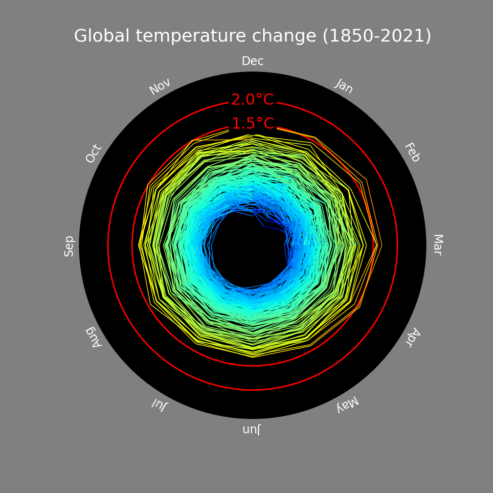

# Climate Spiral Matplotlib
Climate Spiral using matplotlib.

This is the code that accompanies the blog post here:

[Visualising Time Series data With Spirals](https://towardsdatascience.com/visualising-time-series-data-with-spirals-efe0cd9f4c5)

## Notebook
There is a useful jupyter notebook that helps with the explanation of how this works:

[Climage Spiral Notebook](climate_spiral.ipynb)

## Data
The climate data used in this visualisation is the [HadCRUT5](https://www.metoffice.gov.uk/hadobs/hadcrut5/) dataset.

HadCRUT.5.0.1.0 data were obtained from [http://www.metoffice.gov.uk/hadobs/hadcrut5](http://www.metoffice.gov.uk/hadobs/hadcrut5) on 28-March-2022 and are © British Crown Copyright, Met Office 2022, provided under an Open Government License, [http://www.nationalarchives.gov.uk/doc/open-government-licence/version/3/](http://www.nationalarchives.gov.uk/doc/open-government-licence/version/3/)
